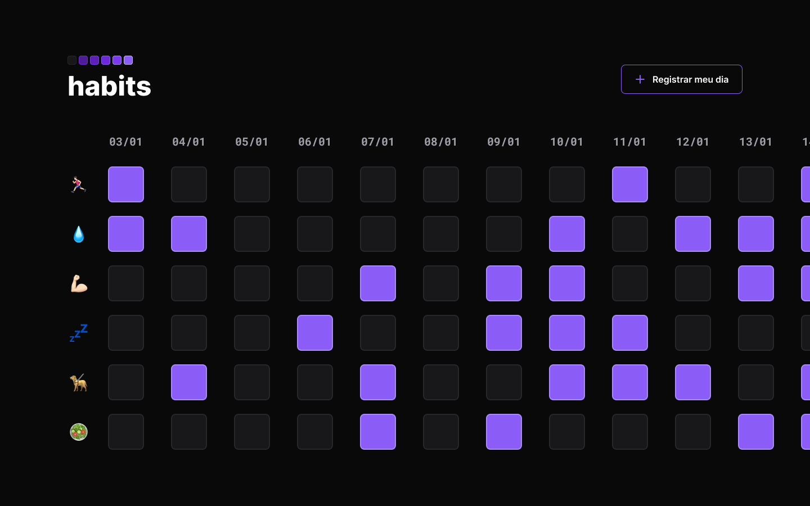

<h1 align="center">⏳ Controle de Habitos  </h1>

  O projeto foi desenvolvido no NLW que  é um evento que ocorre em uma semana  onde tem muito conteúdo é exclusivo e gratuito.  
  É promovido pela Rocketseat para ensino de tecnologias Web.

 

 

## 💻 Projeto
O Habits é um site para ajudar a administrar os hábitos no dia-a-dia.

- [Visite o projeto online](https://abgail-diniz.github.io/Controle-de-Habitos-NLW-Setup-2023/)

 

## 🚀 Tecnologias

Esse projeto foi desenvolvido com as seguintes tecnologias:

- HTML 
- CSS
- JavaScript
- Figma

 

## 🔖 Layout
gi
Você pode visualizar o layout do projeto através [DESSE LINK](https://www.figma.com/community/file/1195327109778210238). É necessário ter conta no [Figma](https://figma.com) para acessá-lo.